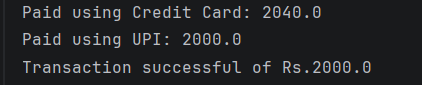

# Java Abstraction – Payment System Example Program

This repository contains a Java program that demonstrates **Abstraction** using a real-world **Payment System** example.

The program shows how different payment methods implement their own logic while following a common structure defined in an abstract class.

---

## 📌 Problem Statement

Design a system where different payment methods calculate and process payments differently using abstraction.

---

## 📌 Program Overview

The program defines:
- An abstract base class `Payment`
- Three derived classes:
  - `CreditCardPayment`
  - `UPIPayment`
  - `CashPayment`

Each class provides its own implementation of the `pay()` method.

---

## 🧪 Code Functionality

- Defines abstract class `Payment`:
  - Contains abstract method `pay(double amount)`
  - Contains concrete method `receipt()` to print confirmation
- Implements different behaviors in child classes:
  - **CreditCardPayment**
    - Adds 2% processing fee
    - Prints final amount
  - **UPIPayment**
    - No extra charge
    - Prints original amount
  - **CashPayment**
    - Checks if amount exceeds ₹5000
    - Prints warning for high transactions
- Uses a reference of type `Payment`
- Demonstrates runtime polymorphism by assigning different objects
- Calls `pay()` and `receipt()` methods

---

## 🧠 Concepts Covered

- Object-Oriented Programming (OOP)  
- Abstraction  
- Abstract classes and methods  
- Method overriding  
- Runtime polymorphism  
- Inheritance  
- Dynamic method dispatch  
- Console output using `System.out.println()`  

---

## 🖥️ Output

📸 **Console output showing different payment methods:**  

---

## 📂 File Information

- `Payment.java` — Abstract base class with main method  
- `CreditCardPayment.java` — Credit card implementation  
- `UPIPayment.java` — UPI payment implementation  
- `CashPayment.java` — Cash payment implementation  
- `output.png` — Screenshot of the program output  
- `README.md` — Project documentation  

---

## ⚠️ Limitations

- Payment amount is hardcoded  
- No user input  
- No real transaction handling  
- No validation for invalid amounts  
- Simplified payment logic for demonstration  

---

## 👨‍💻 Author

**Shreya Awari**  
📧 Email: shreyaawari31@gmail.com  
🌐 GitHub: https://github.com/shreyaawari28  

---

⭐ Star the repository if it helps you understand abstraction using real-world examples.