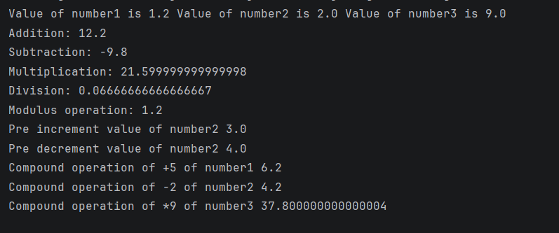

# Java Arithmetic Operators – Example Program

This repository contains a simple Java program that demonstrates the use of **arithmetic, increment/decrement, and compound assignment operators** in Java.

This project is designed for beginners to understand how basic mathematical operations are performed and displayed in Java.

---

## 📌 Program Overview

The program performs arithmetic operations on numeric values using Java operators and prints the results to the console.

It covers:
- Basic arithmetic operations
- Increment and decrement operators
- Compound assignment operators

---

## 🧪 Code Functionality

- Declares three `double` variables
- Performs and prints results of:
  - Addition
  - Subtraction
  - Multiplication
  - Division
  - Modulus
- Demonstrates **pre-increment** and **pre-decrement**
- Demonstrates **compound assignment operators** such as `+=` and `-=`
- Prints results after each operation to observe value changes

---

## 🧠 Concepts Covered

- Arithmetic operators (`+`, `-`, `*`, `/`, `%`)
- Pre-increment (`++`) and pre-decrement (`--`)
- Compound assignment operators (`+=`, `-=`, `*=`)
- Operator precedence
- Variable value modification
- Console output using `System.out.println()`

---

## 🖥️ Output

📸 **Console output showing results of arithmetic operations:**  

---

## 📂 File Information

- `Arithmetic_Operators.java` — Java source code  
- `output.png` — Screenshot of the program output  
- `README.md` — Project documentation  

---

## ⚠️ Limitations

- Values are hardcoded (no user input)
- No validation for division by zero
- Demonstrates only basic arithmetic operators
- No conditional logic or real-world use case

---

## 👨‍💻 Author

**Shreya Awari**  
📧 Email: shreyaawari31@gmail.com  
🌐 GitHub: https://github.com/shreyaawari28  

---

⭐ Star the repository if it helps you understand Java arithmetic operators.

