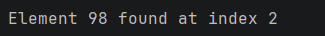
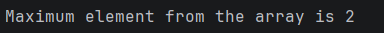
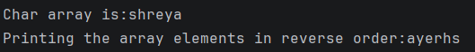
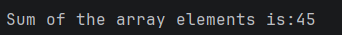
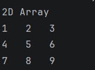
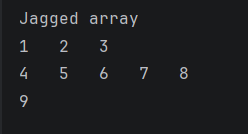

# Java Arrays – One-Dimensional, Two-Dimensional & Jagged Arrays

This repository contains a Java program that demonstrates **array operations** using different array types and traversal techniques.

The program is structured to show **multiple independent outputs**, each focusing on a specific array concept.

---

## 📌 Program Overview

The program performs **five separate array-based operations**:

1. Searching for a specific element in an integer array  
2. Finding the maximum value in an array containing negative numbers  
3. Printing a character array and its reverse order  
4. Calculating the sum of elements in an integer array  
5. Traversing two-dimensional and jagged arrays  

Each operation produces its own visible output on the console.

---

## 🧪 Code Functionality

- Searches an element in an integer array using a `for` loop and stops after finding it
- Finds the maximum value using enhanced `for-each` loop and `Integer.MIN_VALUE`
- Prints a character array normally and then in reverse order
- Calculates the total sum of elements in an integer array
- Traverses:
  - A fixed-size 2D array using nested loops
  - A jagged array (rows of different lengths)

---

## 🧠 Concepts Covered

- One-dimensional arrays  
- Linear search in arrays  
- Enhanced for-each loop  
- Handling negative numbers in arrays  
- Reverse array traversal  
- Array length property  
- Two-dimensional arrays  
- Nested loops  
- Jagged arrays  
- Console output using `System.out.print()` and `System.out.println()`  

---

## 🖥️ Output

📸 **Output 1 – Searching an element in array:**  

📸 **Output 2 – Maximum element in array:**  

📸 **Output 3 – Character array and reverse order:**  

📸 **Output 4 – Sum of array elements:**  

📸 **Output 5 – 2D array traversal:**  

📸 **Output 6 – Jagged array traversal:**  

---

## 📂 File Information

- `Array.java` — Java source code  
- `output1.png` — Search operation output  
- `output2.png` — Maximum element output  
- `output3.png` — Reverse array output  
- `output4.png` — Sum of array elements output  
- `output5.png` — 2D and jagged array output  
- `README.md` — Project documentation  

---

## ⚠️ Limitations

- All arrays are hardcoded
- No user input or dynamic size handling
- Search loop assumes fixed array size
- No error handling for invalid cases
- Demonstrates logic only, not optimized implementations

---

## 👨‍💻 Author

**Shreya Awari**  
📧 Email: shreyaawari31@gmail.com  
🌐 GitHub: https://github.com/shreyaawari28  

---

⭐ Star the repository if it helps you understand Java arrays clearly.

