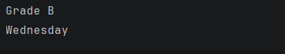

# Java Conditional Statements – If-Else & Switch Case Program

This repository contains a Java program that demonstrates the use of **conditional statements** in Java, specifically the **if–else ladder** and the **switch-case** statement.

This example is designed for **beginners** to understand decision-making and control flow in Java.

---

## 📌 Program Overview

The program performs two independent conditional operations:

1. Evaluates a student’s grade based on marks using an `if–else if–else` ladder  
2. Prints the day of the week based on a numeric value using a `switch` statement  

---

## 🧪 Code Functionality

- Declares an integer variable `marks` to represent student marks
- Uses an `if–else if–else` ladder to:
  - Assign grades based on marks range
  - Print the corresponding grade
- Declares an integer variable `day`
- Uses a `switch-case` statement to:
  - Match numeric day values (1–7)
  - Print the corresponding day name
  - Handle invalid values using `default`

---

## 🧠 Concepts Covered

- Conditional statements in Java  
- `if–else if–else` ladder  
- Comparison operators (`>=`)  
- Logical flow control  
- `switch-case` statement  
- Use of `break` to prevent fall-through  
- Console output using `System.out.println()`  

---

## 🖥️ Output

📸 **Console output showing grade evaluation and day selection:**  

---

## 📂 File Information

- `conditional.java` — Java source code  
- `output.png` — Screenshot of the program output  
- `README.md` — Project documentation  

---

## ⚠️ Limitations

- Marks and day values are hardcoded
- No user input handling
- No validation for marks beyond logical ranges
- Demonstrates logic only; no real-world integration

---

## 👨‍💻 Author

**Shreya Awari**  
📧 Email: shreyaawari31@gmail.com  
🌐 GitHub: https://github.com/shreyaawari28  

---

⭐ Star the repository if it helps you understand Java conditionals.

