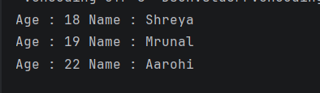

# Java Constructor Overloading – Example Program

This repository contains a Java program that demonstrates **constructor overloading** using a simple class with multiple constructors.

The program helps beginners understand how objects can be initialized in different ways using **constructors with different parameters**.

---

## 📌 Program Overview

The program defines a class with:
- A **default constructor**
- A **single-parameter constructor**
- A **two-parameter constructor**

Each constructor initializes object data differently, and the results are displayed using a method.

---

## 🧪 Code Functionality

- Declares instance variables `age` and `name`
- Defines multiple constructors:
  - Default constructor initializes with fixed values
  - Constructor with one parameter initializes name
  - Constructor with two parameters initializes both age and name
- Uses `this` keyword to assign values to instance variables
- Defines a `display()` method to print object details
- Creates multiple objects using different constructors
- Calls `display()` method to show the values

---

## 🧠 Concepts Covered

- Object-Oriented Programming (OOP)  
- Constructors in Java  
- Constructor overloading  
- `this` keyword  
- Instance variables  
- Method definition and calling  
- Class and object creation  
- Console output using `System.out.println()`  

---

## 🖥️ Output

📸 **Console output showing values initialized using different constructors:**  

---

## 📂 File Information

- `Constructorss.java` — Java source code  
- `output.png` — Screenshot of the program output  
- `README.md` — Project documentation  

---

## ⚠️ Limitations

- Values are hardcoded
- No user input handling
- No validation of input data
- Demonstrates only basic constructor overloading

---

## 👨‍💻 Author

**Shreya Awari**  
📧 Email: shreyaawari31@gmail.com  
🌐 GitHub: https://github.com/shreyaawari28  

---

⭐ Star the repository if it helps you understand constructor overloading in Java.
