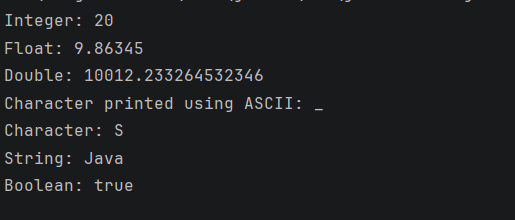

# Java Data Types – Example Program

This repository contains a simple Java program that demonstrates the usage of **primitive and non-primitive data types** in Java and how they are printed to the console.

This project is meant for **absolute beginners** to clearly understand how different data types behave during output.

---

## 📌 Program Overview

The program demonstrates how Java handles and prints different data types using `System.out.println()`.

It covers:
- Numeric data types
- Character data types (including ASCII usage)
- String
- Boolean

---

## 🧪 Code Functionality

- Declares variables of multiple data types:
  - `int`
  - `float`
  - `double`
  - `char` (ASCII and literal)
  - `String`
  - `boolean`
- Prints each variable with a clear label
- Demonstrates how a `char` can be assigned using an ASCII value
- Shows default console output formatting for numeric values

---

## 🧠 Concepts Covered

- Primitive data types in Java  
- Non-primitive data type (`String`)  
- Variable declaration and initialization  
- ASCII value representation using `char`  
- Console output using `System.out.println()`  
- Type-specific output behavior  

---

## 🖥️ Output

📸 **Console output showing values of different data types:**  

---

## 📂 File Information

- `Datatype.java` — Java source code  
- `output.png` — Screenshot of the program output  
- `README.md` — Project documentation  

---

## ⚠️ Limitations

- Values are hardcoded (no user input)
- No interaction or dynamic behavior
- No validation or error handling
- Demonstrates output only (no logic or conditions)

---

## 👨‍💻 Author

**Shreya Awari**  
📧 Email: shreyaawari31@gmail.com  
🌐 GitHub: https://github.com/shreyaawari28  

---

⭐ Star the repository if it helps you understand Java basics.

