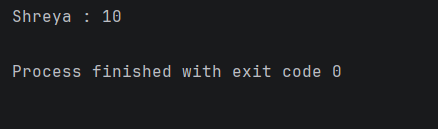

# Java Encapsulation – Getter Method Example Program

This repository contains a Java program that demonstrates the concept of **Encapsulation** in Object-Oriented Programming (OOP).

The program shows how **private variables** can be accessed using **public getter methods** while keeping the data protected.

---

## 📌 Program Overview

The program defines a class with **private data members** and provides **public getter methods** to access those values.

This ensures that internal data is **protected from direct modification** while still allowing controlled access.

---

## 🧪 Code Functionality

- Defines a class containing private variables `Age` and `Name`
- Prevents direct access to these variables from outside the class
- Provides **getter methods** to retrieve the values
- Creates an object of the class in `main`
- Accesses the values through the getter methods
- Prints the retrieved values to the console

---

## 🧠 Concepts Covered

- Object-Oriented Programming (OOP)  
- Encapsulation  
- Access modifiers (`private`, `public`)  
- Getter methods  
- Class and object creation  
- Controlled data access  
- Console output using `System.out.println()`  

---

## 🖥️ Output

📸 **Console output showing encapsulated data access:**  

---

## 📂 File Information

- `Encapsulation.java` — Java source code  
- `output.png` — Screenshot of the program output  
- `README.md` — Project documentation  

---

## ⚠️ Limitations

- Values are hardcoded inside the class
- No setter methods provided to modify values
- No user input
- Demonstrates only basic encapsulation concept

---

## 👨‍💻 Author

**Shreya Awari**  
📧 Email: shreyaawari31@gmail.com  
🌐 GitHub: https://github.com/shreyaawari28  

---

⭐ Star the repository if it helps you understand encapsulation in Java.
