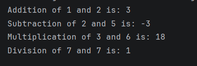

# Java Inheritance – Calculator Example Program

This repository contains a Java program that demonstrates the concept of **Inheritance** in Object-Oriented Programming (OOP) using a calculator example.

The program shows how a **child class (AdvCalc)** can inherit properties and methods from a **parent class (Calc)** and extend its functionality.

---

## 📌 Program Overview

The program uses:
- A **base class (`Calc`)** with multiplication and division methods  
- A **derived class (`AdvCalc`)** that inherits from `Calc` and adds addition and subtraction methods  

An object of the child class is used to access **all operations**.

---

## 🧪 Code Functionality

- Defines a parent class `Calc`:
  - Contains `mul()` and `div()` methods  
- Defines a child class `AdvCalc`:
  - Inherits from `Calc` using `extends`
  - Adds `add()` and `sub()` methods  
- Creates an object of `AdvCalc` in `main`
- Calls all four operations:
  - Addition  
  - Subtraction  
  - Multiplication (inherited)  
  - Division (inherited)  
- Prints results to the console

---

## 🧠 Concepts Covered

- Object-Oriented Programming (OOP)  
- Inheritance  
- `extends` keyword  
- Parent (superclass) and child (subclass)  
- Code reusability  
- Method usage across classes  
- Console output using `System.out.println()`  

---

## 🖥️ Output

📸 **Console output showing all arithmetic operations:**  

---

## 📂 File Information

- `Inheritance.java` — Main class  
- `Calc.java` — Parent class  
- `AdvCalc.java` — Child class  
- `output.png` — Screenshot of the program output  
- `README.md` — Project documentation  

---

## ⚠️ Limitations

- Inputs are hardcoded  
- No user input handling  
- No validation for division by zero  
- Demonstrates basic inheritance only  

---

## 👨‍💻 Author

**Shreya Awari**  
📧 Email: shreyaawari31@gmail.com  
🌐 GitHub: https://github.com/shreyaawari28  

---

⭐ Star the repository if it helps you understand inheritance in Java.