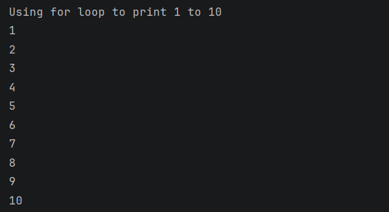
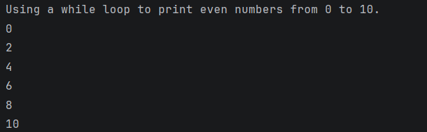
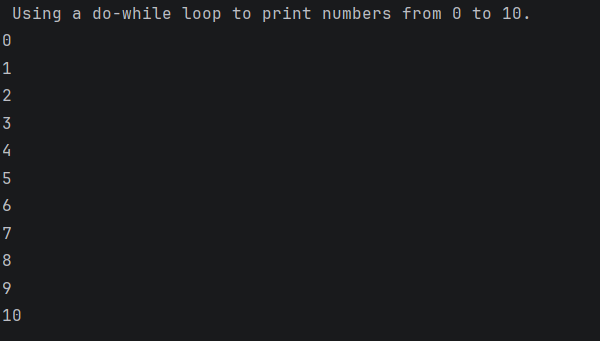

# Java Loops – for, while & do-while Example Program

This repository contains a Java program that demonstrates the usage of **looping statements** in Java: `for`, `while`, and `do-while`.

The program is intended for **beginners** to understand how different loops work and when to use each one.

---

## 📌 Program Overview

The program uses three different loops to print numbers based on specific conditions:

1. `for` loop – prints numbers from 1 to 10  
2. `while` loop – prints even numbers from 0 to 10  
3. `do-while` loop – prints numbers from 0 to 10  

Each loop produces **separate output** to clearly show the difference in behavior.

---

## 🧪 Code Functionality

- Uses a `for` loop to:
  - Initialize, check condition, and update in one line
  - Print numbers from 1 to 10
- Uses a `while` loop to:
  - Check the condition before execution
  - Print only even numbers using the modulus operator (`%`)
- Uses a `do-while` loop to:
  - Execute the loop body at least once
  - Print numbers from 0 to 10
- Prints clear labels before each loop’s output

---

## 🧠 Concepts Covered

- Looping statements in Java  
- `for` loop syntax and usage  
- `while` loop condition checking  
- `do-while` loop execution flow  
- Modulus operator (`%`) for even number checking  
- Increment operators  
- Console output using `System.out.println()`  

---

## 🖥️ Output

📸 **Output 1 – Using for loop (1 to 10):**  

📸 **Output 2 – Using while loop (Even numbers 0 to 10):**  

📸 **Output 3 – Using do-while loop (0 to 10):**  

---

## 📂 File Information

- `Loop.java` — Java source code  
- `output1.png` — for loop output screenshot  
- `output2.png` — while loop output screenshot  
- `output3.png` — do-while loop output screenshot  
- `README.md` — Project documentation  

---

## ⚠️ Limitations

- Loop ranges are hardcoded
- No user input
- No dynamic conditions
- Program demonstrates syntax only, not real-world scenarios

---

## 👨‍💻 Author

**Shreya Awari**  
📧 Email: shreyaawari31@gmail.com  
🌐 GitHub: https://github.com/shreyaawari28  

---

⭐ Star the repository if it helps you understand Java loops.

