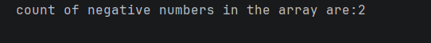

# Java Negative Numbers Counter – Array Example Program

This repository contains a simple Java program that demonstrates how to **count negative numbers in an integer array**.

The program is designed for **beginners** to understand array traversal and conditional checking.

---

## 📌 Program Overview

The program iterates through an integer array and counts how many elements are **negative**.

---

## 🧪 Code Functionality

- Declares an integer array containing positive and negative values
- Initializes a counter variable
- Uses an enhanced `for-each` loop to traverse the array
- Checks each element using a conditional statement
- Increments the counter when a negative number is found
- Prints the total count of negative numbers

---

## 🧠 Concepts Covered

- One-dimensional arrays  
- Enhanced `for-each` loop  
- Conditional statements (`if`)  
- Comparison operators (`<`)  
- Counter logic  
- Console output using `System.out.println()`  

---

## 🖥️ Output

📸 **Console output showing the count of negative numbers:**  

---

## 📂 File Information

- `NegNumbers.java` — Java source code  
- `output.png` — Screenshot of the program output  
- `README.md` — Project documentation  

---

## ⚠️ Limitations

- Array values are hardcoded
- No user input
- Counts only negative numbers (does not list them)
- No handling for empty arrays

---

## 👨‍💻 Author

**Shreya Awari**  
📧 Email: shreyaawari31@gmail.com  
🌐 GitHub: https://github.com/shreyaawari28  

---

⭐ Star the repository if it helps you practice Java array logic.

