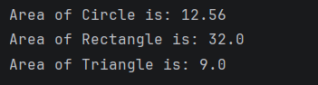

# Java Polymorphism – Shape Area Calculation Program

This repository contains a Java program that demonstrates **Runtime Polymorphism** using the concept of **method overriding** with a Shape example.

The program shows how a **parent class reference** can be used to call different implementations based on the object it refers to.

---

## 📌 Program Overview

The program defines a base class `Shape` and multiple derived classes:
- `Circle`
- `Rectangle`
- `Triangle`

Each class overrides the `calculateArea()` method to compute its own area.

---

## 🧪 Code Functionality

- Defines a parent class `Shape` with a general `calculateArea()` method  
- Creates child classes (`Circle`, `Rectangle`, `Triangle`) that override the method  
- Uses a single reference variable of type `Shape`  
- Dynamically assigns different objects to the reference  
- Calls `calculateArea()` for each object  
- Demonstrates **dynamic method dispatch (runtime polymorphism)**  

---

## 🧠 Concepts Covered

- Object-Oriented Programming (OOP)  
- Polymorphism  
- Runtime polymorphism  
- Method overriding  
- Dynamic method dispatch  
- Inheritance  
- Base class and derived classes  
- Console output using `System.out.println()`  

---

## 🖥️ Output

📸 **Console output showing area calculation for different shapes:**  

---

## 📂 File Information

- `Shape.java` — Base class with main method  
- `Circle.java` — Derived class for circle area  
- `Rectangle.java` — Derived class for rectangle area  
- `Triangle.java` — Derived class for triangle area  
- `output.png` — Screenshot of the program output  
- `README.md` — Project documentation  

---

## ⚠️ Limitations

- Values are hardcoded  
- No user input  
- Uses approximate value of π (3.14)  
- Triangle area formula is simplified (not using ½ × base × height)  
- No validation for invalid dimensions  

---

## 👨‍💻 Author

**Shreya Awari**  
📧 Email: shreyaawari31@gmail.com  
🌐 GitHub: https://github.com/shreyaawari28  

---

⭐ Star the repository if it helps you understand polymorphism in Java.