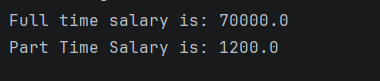

# Java Abstraction – Employee Salary Calculation Program

This repository contains a Java program that demonstrates the concept of **Abstraction** using an employee salary calculation example.

The program shows how a **base class (Employee)** provides a general structure, while derived classes implement specific behaviors.

---

## 📌 Program Overview

The program defines:
- A base class `Employee`
- Two derived classes:
  - `FullTimeEmployee`
  - `PartTimeEmployee`

Each class provides its own implementation of the `calculateSalary()` method.

---

## 🧪 Code Functionality

- Defines a base class `Employee` with a general `calculateSalary()` method  
- Creates child classes that override this method:
  - `FullTimeEmployee` assigns a fixed salary  
  - `PartTimeEmployee` calculates salary based on working hours  
- Uses a reference variable of type `Employee`  
- Dynamically assigns objects of different subclasses  
- Calls `calculateSalary()` to demonstrate runtime behavior  

---

## 🧠 Concepts Covered

- Object-Oriented Programming (OOP)  
- Abstraction  
- Method overriding  
- Runtime polymorphism  
- Inheritance  
- Dynamic method dispatch  
- Use of base class reference  
- Console output using `System.out.println()`  

---

## 🖥️ Output

📸 **Console output showing salary calculation for different employee types:**
  

---

## 📂 File Information

- `Employee.java` — Base class with main method  
- `FullTimeEmployee.java` — Derived class for full-time salary  
- `PartTimeEmployee.java` — Derived class for part-time salary  
- `output.png` — Screenshot of the program output  
- `README.md` — Project documentation  

---

## ⚠️ Limitations

- Salary values are hardcoded  
- No user input  
- No validation for working hours  
- Base class is not truly abstract (can still be instantiated if modified)  
- Simplified salary logic  

---

## 👨‍💻 Author

**Shreya Awari**  
📧 Email: shreyaawari31@gmail.com  
🌐 GitHub: https://github.com/shreyaawari28  

---

⭐ Star the repository if it helps you understand abstraction in Java.