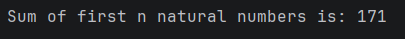

# Java Sum of Natural Numbers – Recursion Example Program

This repository contains a Java program that demonstrates how to **calculate the sum of the first _n_ natural numbers using recursion**.

The example is designed for **beginners** to clearly understand recursive logic and base conditions.

---

## 📌 Program Overview

The program calculates the sum using the recursive definition:

- `Sum(n) = n + Sum(n − 1)`
- Base condition: `Sum(1) = 1`

The recursive method keeps calling itself until it reaches the base condition.

---

## 🧪 Code Functionality

- Calls the `Sum()` method from the `main` method
- Uses recursion to compute the sum
- Defines a base case to stop recursion
- Adds the current number with the sum of previous numbers
- Prints the final result to the console

---

## 🧠 Concepts Covered

- Recursion in Java  
- Base condition in recursion  
- Method self-calling  
- Stack-based execution flow  
- Natural number summation logic  
- Console output using `System.out.println()`  

---

## 🖥️ Output

📸 **Console output showing sum of natural numbers:**  

---

## 📂 File Information

- `SumUsingRecursion.java` — Java source code  
- `output.png` — Screenshot of the program output  
- `README.md` — Project documentation  

---

## ⚠️ Limitations

- Value of `n` is hardcoded
- Works only for positive integers
- No user input support
- May cause stack overflow for very large values of `n`

---

## 👨‍💻 Author

**Shreya Awari**  
📧 Email: shreyaawari31@gmail.com  
🌐 GitHub: https://github.com/shreyaawari28  

---

⭐ Star the repository if it helps you understand recursion clearly.
