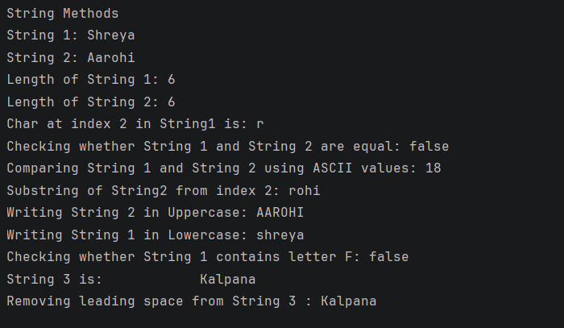

# Java String Methods – Example Program

This repository contains a Java program that demonstrates commonly used **String methods** in Java and how they behave during console output.

This example is aimed at **beginners** to understand string manipulation clearly using built-in methods.

---

## 📌 Program Overview

The program works with multiple `String` variables and applies different **String class methods** to them.  
It prints results directly to the console for easy observation.

---

## 🧪 Code Functionality

- Declares multiple `String` variables
- Prints string values and their lengths
- Accesses a character at a specific index
- Compares strings using:
  - Case-insensitive equality
  - Lexicographical (ASCII-based) comparison
- Extracts substrings
- Converts strings to uppercase and lowercase
- Checks for the presence of a character/substring
- Demonstrates removal of leading whitespace using `trim()`

---

## 🧠 Concepts Covered

- String declaration and initialization  
- `length()`  
- `charAt()`  
- `equalsIgnoreCase()`  
- `compareToIgnoreCase()`  
- `substring()`  
- `toUpperCase()`  
- `toLowerCase()`  
- `contains()`  
- `trim()`  
- Console output using `System.out.println()`

---

## 🖥️ Output

📸 **Console output demonstrating String methods:**  

---

## 📂 File Information

- `Strings.java` — Java source code  
- `output.png` — Screenshot of the program output  
- `README.md` — Project documentation  

---

## ⚠️ Limitations

- Strings are hardcoded (no user input)
- No null or bounds checking (e.g., `charAt()` assumes valid index)
- Demonstrates methods only; no real-world use case
- Output is limited to console display

---

## 👨‍💻 Author

**Shreya Awari**  
📧 Email: shreyaawari31@gmail.com  
🌐 GitHub: https://github.com/shreyaawari28  

---

⭐ Star the repository if it helps you understand Java String basics.

