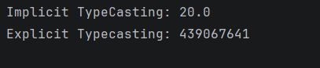

# Java Type Casting – Example Program

This repository contains a simple Java program that demonstrates **type casting** in Java, specifically **implicit (widening)** and **explicit (narrowing)** type casting.

This project is intended for beginners who want a clear, practical understanding of how Java converts one data type into another.

---

## 📌 Program Overview

The program demonstrates how values are converted between compatible data types using type casting.

It covers:
- Implicit (automatic) type casting  
- Explicit (manual) type casting  
- Data loss during narrowing conversion  

---

## 🧪 Code Functionality

- Declares an `int` variable and assigns it to a `float` using **implicit type casting**
- Declares a `long` variable and converts it to an `int` using **explicit type casting**
- Prints both results to show how Java handles conversions
- Highlights how explicit casting can lead to **data loss**

---

## 🧠 Concepts Covered

- Type casting in Java  
- Implicit (widening) type casting  
- Explicit (narrowing) type casting  
- Automatic vs manual conversion  
- Data loss in narrowing conversions  
- Console output using `System.out.println()`  

---

## 🖥️ Output

📸 **Console output showing implicit and explicit type casting results:**  

---

## 📂 File Information

- `TypeCasting.java` — Java source code  
- `output.png` — Screenshot of the program output  
- `README.md` — Project documentation  

---

## ⚠️ Limitations

- Values are hardcoded (no user input)
- No validation for overflow or range issues
- Demonstrates only basic numeric type casting
- No real-world use case or logic applied

---

## 👨‍💻 Author

**Shreya Awari**  
📧 Email: shreyaawari31@gmail.com  
🌐 GitHub: https://github.com/shreyaawari28  

---

⭐ Star the repository if it helps you understand Java type casting.

